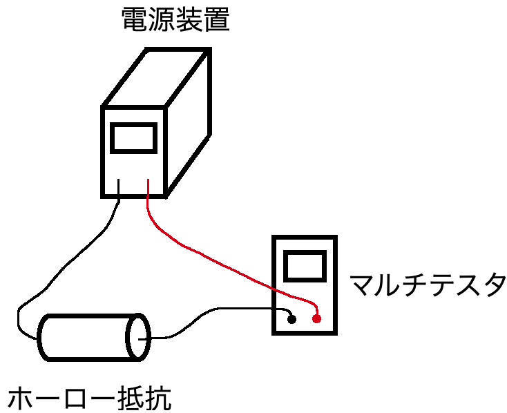
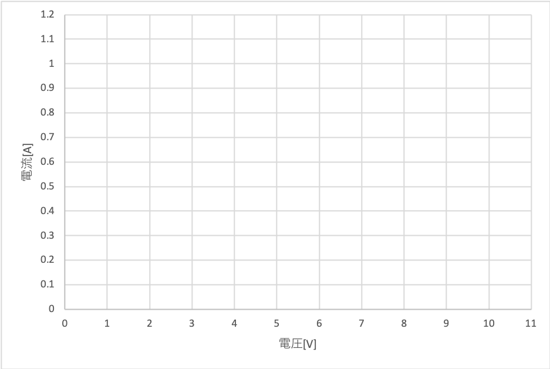

###### 電気電子実験
# 抵抗回路の測定

## 1. 目的
オームの法則とは $$ V=IR $$ という関係式で表される。Vは電圧、Iは電流、Rは電気抵抗とし、電気回路の2点間の電位差は、電流と電気抵抗に比例することを意味している。  
本実験では、電圧・電流・抵抗が $$ V=IR $$ という関係で成り立っていることを、実験を通じて確認する。

## 2. 実験方法

  ### 実験1
  下の図のように回路を組み、電源装置の電圧を変化させたとき、回路を流れる電流を記録する。  
  また、記録は表とともに、横軸を電圧、縦軸を電流としたグラフを作成する。
    

  ### 実験2
  抵抗値が未知であるホーロー抵抗を実験1と同様の回路に接続し、電源装置の電圧を変化させたときに回路を流れる電流を記録する。
  実験結果から、このホーロー抵抗の抵抗値を推定する。

## 3. 使用器具
- 電源装置
- ホーロー抵抗
- デジタルマルチテスタ
- 電線等

## 4. 実験結果

  ### 実験1
  |電源電圧[V]|電流[A]
  |:-:|:-:|
  |0||
  |1.0||
  |2.0||
  |3.0||
  |4.0||
  |5.0||
  |6.0||
  |7.0||
  |8.0||
  |9.0||
  |10||
    

  ### 実験2
  |電源電圧[V]|電流[A]
  |:-:|:-:|
  |0||
  |1.0||
  |2.0||
  |3.0||
  |4.0||
  |5.0||
  |6.0||
  |7.0||
  |8.0||
  |9.0||
  |10||
    

## 5. 考察
1. 実験1において、電源電圧と抵抗を流れる電流にはどういった関係があるか。オームの法則の説明とともに考察せよ。
2. 実験2において、オームの法則を用いて未知抵抗の抵抗値[Ω]を算出せよ。
3. 実験2において、グラフの縦軸と横軸を転置し、グラフの傾きと算出した抵抗値の関係について述べよ。
