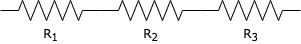
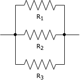
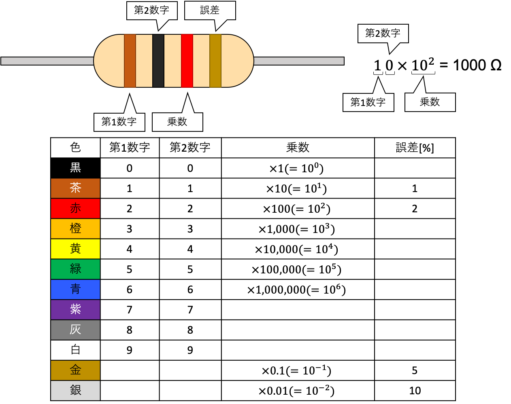

###### 電気電子実験
# 抵抗回路の測定2

## 1. 目的
合成抵抗回路の計算法を習得し、理論通りの抵抗値が得られるか実験にて確認する。抵抗のカラーコードについて学習し、読めるようになる。ブレッドボードの構造を理解し、適切な実験回路の作成方法を習得する。  

## 2. 実験方法
  ### 合成抵抗の計算法
  複数の抵抗を直列接続した際、合成した抵抗値は各抵抗の和で表される。  
  

  $$ R = R_1+R_2+R_3+\dots $$

  複数の抵抗を並列接続した際、合成した抵抗値は各抵抗値の逆数の和を逆数にしたもので表される。  
    

  $$ R = \frac{1}{\frac{1}{R_1}+\frac{1}{R_2}+\frac{1}{R_3}+\dots} $$

  特に抵抗が2つの場合、式変形を行うと以下の和分の積と呼ばれる式が得られる。  

  $$ R=\frac{R_1 R_2}{R_1+R_2} $$

  ### 抵抗のカラーコードについて
  

  ### 実験1
  カーボン抵抗のカラーコードを読み、抵抗R1, R2, R3の抵抗値を読み取る。  
  合成抵抗の計算法を参考に理論値の算出を行うとともに、ブレッドボード上に下記の回路を組み、合成抵抗をマルチテスタで測定する。
    

  ### 実験2
  ※実験1で使用した抵抗を再度用いる。  
  合成抵抗の計算法を参考に理論値の算出を行うとともに、ブレッドボード上に下記の回路を組み、合成抵抗をマルチテスタで測定する。  
  

## 3. 使用器具
- カーボン抵抗
- マルチテスタ

## 4. 実験結果
  ### 実験1
  |抵抗|抵抗値[Ω]|
  |:-:|:-:|
  |R1||
  |R2||
  |R3||

  |合成抵抗の理論値[Ω]|合成抵抗の実測値[Ω]|
  |:-:|:-:|
  |$$  $$|$$  $$|

  ### 実験2
  |抵抗|抵抗値[Ω]|
  |:-:|:-:|
  |R1||
  |R2||
  |R3||

  |合成抵抗の理論値[Ω]|合成抵抗の実測値[Ω]|
  |:-:|:-:|
  |$$  $$|$$  $$|

## 5. 考察
1. 直列接続した合成抵抗の抵抗値が各抵抗の和で表されるのはなぜか。下記の抵抗体の抵抗を求める式を用いて説明せよ。ただし、Rは抵抗値、ρは抵抗率、lは抵抗体の長さ、Sは抵抗体の断面積とする。  
$$ R = \rho\frac{l}{S} $$
1. 1.と同様に、並列接続した合成抵抗についても説明せよ。
1. 市販の抵抗は、E12系列やE24系列といったように、一見不規則な抵抗値のラインナップがある。なぜこのような系列でラインナップされているか、許容誤差の観点から考察せよ。
